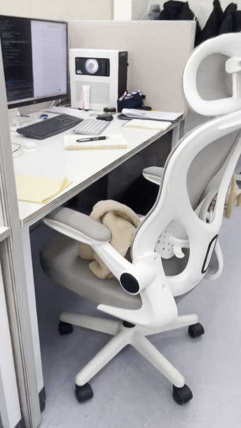
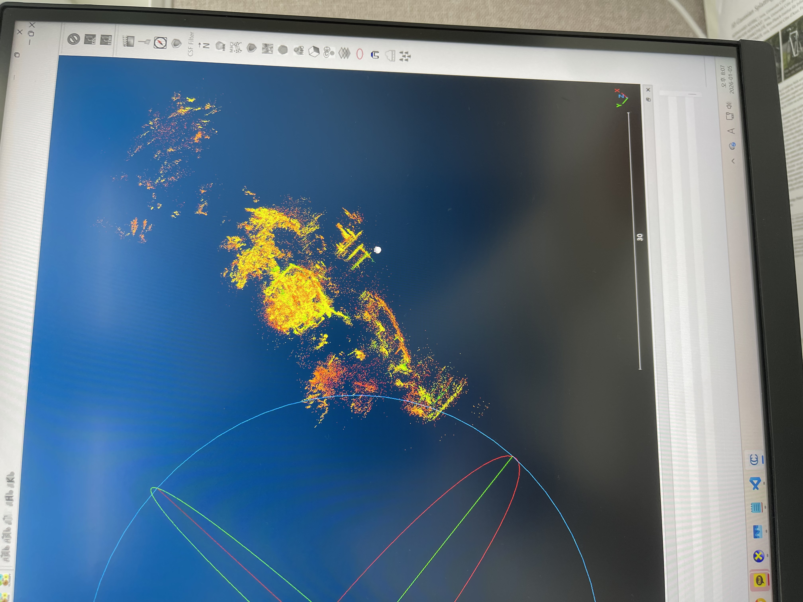
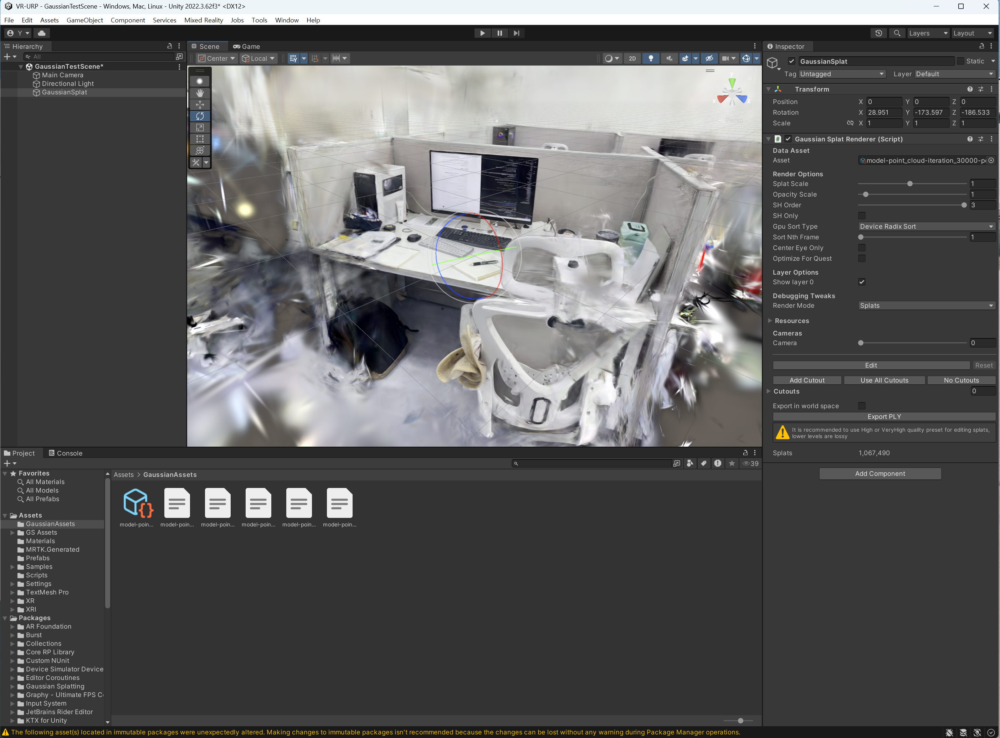

# 연구실 자리의 외관을 촬영에서 Unity까지 옮기기

연구실 책상 주변을 직접 촬영한 영상에서 카메라 위치와 희소 구조를 구하고, 3D Gaussian Splatting으로 외관을 학습한 뒤 Unity에 연결했다. 남아 있는 자료는 **66개 프레임, 59개 등록 시점, 7k·30k Gaussian 모델, Unity 변환 자산**으로 이어진다. 이 작업에서 확인된 성과는 실제 자리의 외관을 새로운 카메라 위치에서 렌더링하고 엔진 안에 표시한 것이다. 이후 2026-09-16에는 보존된 모델을 CUDA로 다시 렌더링해 학습 시점의 적합도를 비교하고, 30k 모델에서 새 optimizer로 200회 추가 최적화했다.

<a href="evidence/public/mydesk-camera-path.mp4"></a>

*그림 1. 보존된 30k PLY를 2026-09-16에 실제 CUDA rasterizer로 렌더링한 480×854 시점이다. 책상 위 물체와 의자·파티션의 외관이 같은 장면 안에 재구성되어 있다. [카메라 이동 렌더](evidence/public/mydesk-camera-path.mp4)는 이 모델에서 회전을 SLERP, 위치를 선형 보간한 경로의 200프레임·24 fps·8.33초 구간이다. 기존 촬영 경로 주변의 연속성을 보여 주며, 촬영 범위 밖의 형상이나 완전히 새로운 관측에서의 정확도를 측정한 실험은 아니다. 공개 구간은 배경 사람이 없는 부분을 선별했다.*

[독립 연구 저장소](https://github.com/YuSihyeon/LabDeskGaussianSplatting) · [보존한 상세 연구 기록](RESEARCH_REPORT.md) · [전체 입력·모델·환경의 복원 경로](DATA_AND_RESTORE.md)

## 실제 자리를 어떤 표현으로 가져올 것인가

이 연구에서 직접 확인되는 출발점은 촬영한 공간을 복원하고 엔진에 표시하려는 작업 흐름이다. 자리 촬영 영상, `mydesk` 데이터셋, 학습 PLY, 점군 점검 화면, Unity 자산이 그 근거다. 실제 책상과 주변 물체를 수작업으로 하나씩 모델링하는 부담을 줄이고 촬영 당시의 외관을 유지하려 했다는 설명은 이 흐름에 부합하는 **사후 해석**이다. 그 동기나 도구 간 우열을 명시한 당시 연구계획서·선정 비교표는 발견되지 않았다. VR 지원 renderer를 연결한 사실은 확인되지만, 헤드셋에서 검증한 결과는 남아 있지 않다.

파일에 남은 선택을 따라가면 각 단계가 서로 다른 질문을 맡는다. FFmpeg는 시간적으로 연속된 영상을 반복 가능한 이미지 입력으로 바꾸고, COLMAP은 그 이미지들을 같은 공간에 놓을 카메라와 희소점을 제공한다. Graphdeco 3DGS는 그 구조에서 출발해 시점에 따라 보이는 색을 Gaussian의 위치·크기·방향·불투명도와 SH 계수로 표현한다. CloudCompare에서는 학습 결과의 점 위치 분포를 살폈고, Unity에서는 학습 도구 밖에서도 같은 외관을 표시할 수 있는지 확인했다. 실제 코드와 산출물에서 읽히는 기술 선택의 의미는 이처럼 단계별로 관찰할 대상을 연결한 데 있다.

초기 자료에는 다른 복원 시도도 있다. `2025-12-27` 이름의 가방 폴더에는 Postshot 프로젝트와 촬영 기록이 있고, 연구실 폴더에는 Polycam 영상과 GLB가 남아 있다. 이는 작은 대상과 공간을 각각 복원해 본 흔적이다. Postshot 화면의 30 kSteps·3,000 kSplats는 설정 상한으로 읽어야 하며 완료된 학습량이 아니다. Polycam의 표면 모델을 이후 `mydesk` Gaussian 모델과 동일한 실험으로 합치거나, 후속 방법을 택한 원인이었다고 단정할 기록도 없다. [원자료 관찰](evidence/observations.md)과 [영상 길이·해시 목록](evidence/video-inventory.json)이 각 자료를 구분한다.

따라서 이 프로젝트의 기여는 새로운 Gaussian 학습 알고리즘 개발보다, **직접 촬영한 특정 공간에 전처리·기존 학습 구현·구조 점검·엔진 표시를 연결하고 그 연결의 성공과 공백을 확인한 데** 있다. 정밀 측량, 충돌 메시, 로봇 물리 연동, 재조명은 이 작업에서 검증하지 않았다.

## 66개 이미지가 59개 카메라로 정리되는 과정

### 촬영을 정적 다중시점 입력으로 바꾸기

재구성 입력은 약 32.895초, 1080×1920의 `mydesk.mp4`다. 원영상은 986프레임이며, 여기서 준비된 PNG는 66개다. [전처리 코드](evidence/historical/video_to_gs_dataset.py)의 기본 추출률은 2 fps로 영상 길이와 프레임 수에 부합한다. 다만 당시 명령이 남아 있지 않아 실제 실행에서 기본값을 사용했다고 확정하지 않는다. `2026_01_08/my desk.mp4`는 모니터에 표시된 뷰어를 카메라로 촬영한 시연 기록이므로, 이 원영상과 입력 역할이 다르다.

스크립트는 FFmpeg의 `fps` 필터로 PNG를 만들고 COLMAP `feature_extractor`에 카메라 모델과 single-camera 설정을 전달한다. 이어 `exhaustive_matcher`로 이미지 쌍을 연결하고 `mapper`로 희소 모델을 구한 뒤, 기본 선택인 `sparse/0`을 `image_undistorter`에 넘긴다. 마지막으로 보정 이미지와 희소 구조를 `gs_dataset/images`, `gs_dataset/sparse/0`에 배치한다. 즉 프레임 추출만으로 학습 자료가 완성되는 것이 아니라, 서로 연결되는 카메라를 구하고 왜곡을 보정하는 단계를 거친다.

COLMAP DB에는 66개 이미지, 1개 카메라, 254,155개 특징점과 2,145개 영상 쌍이 있다. 2,145는 66개 이미지의 전체 쌍 수이고, 그중 683개 쌍에 검증된 inlier가 있다. 전체 쌍을 검사한 설계는 이 정도 규모에서 인접 프레임 외의 연결도 찾는 역할을 한다고 해석할 수 있다. 다만 다른 매칭 방식보다 유리한지 비교한 실험은 없다. [프레임·DB·희소점 감사](evidence/historical-statistics.json).

### 등록되지 않은 7개 프레임이 말해 주는 것

최종 학습 폴더에는 왜곡 보정된 1062×1888 이미지 59개가 있고, 그 이름은 희소 모델의 등록 이미지 집합과 정확히 일치한다. 등록률은 **59/66 = 89.39%**다. 빠진 파일은 `000044.png`부터 `000049.png`까지와 `000061.png`다. 모두 원프레임 폴더와 COLMAP DB에는 존재하며 각 이미지에 118~1,210개의 특징점도 남아 있다. 파일 누락이나 특징 추출 자체의 실패로 설명할 수 있는 상황은 아니다.

이 증거로 확인할 수 있는 것은 해당 프레임들이 등록·왜곡 보정 이후의 학습 집합에 들어오지 않았다는 사실이다. 사람이 수동으로 나쁜 이미지를 삭제했다고 해석할 근거는 없다. 낮은 시점 겹침, 블러, 저텍스처는 가능한 원인이지만 프레임별 실패 로그가 없어 어느 원인이 지배적이었는지 가를 수 없다. 등록률은 처리된 입력의 범위를 설명하는 값이며, 영상에 담긴 모든 표면을 충분히 관측했다는 지표도 아니다.

현재 희소 구조는 8,322점이고 한 점을 지지하는 관측의 평균 track 길이는 4.582다. 재투영 오차는 평균 0.7268 px, 중앙값 0.5915 px, 95백분위 1.7455 px다. 여러 카메라의 특징점이 영상 평면에서 얼마나 일관되게 설명되는지를 보여 주는 수치다. 장면의 실제 길이 기준이나 기준 스캔이 없으므로 이를 mm·cm 단위 형상 정확도로 바꿀 수는 없다.

원영상의 카메라는 SIMPLE_RADIAL, 추정 focal 1668.9216 px, radial 항 0.0377827이고, 보정 후에는 PINHOLE, 1062×1888, fx=fy=1668.9216 px로 저장되었다. `dense` 폴더도 있지만 depth·normal·consistency 출력과 `fused.ply`는 없다. 이 단계에서 확인된 공간 표현은 희소 구조이며 dense MVS나 메시 생성 완료로 해석하지 않는다.

## 희소점을 Gaussian 외관 모델로 확장하고 점검하기

### 저장된 두 모델에서 확인되는 표현의 변화

학습 모델 폴더에는 초기점 `input.ply`와 `iteration_7000`, `iteration_30000`의 결과가 있다. 현재 데이터셋의 희소점과 모델의 초기점은 수가 약간 다르므로 아래에서 분리해 기록한다.

| 산출물 | 점 또는 Gaussian 수 | 파일 크기 |
|---|---:|---:|
| 현재 `gs_dataset/sparse/0/points3D.ply` | 8,322점 | 희소 구조 |
| 모델의 `input.ply` | 8,326점 | 학습 입력 snapshot |
| `iteration_7000/point_cloud.ply` | 720,554 | 178,698,923 bytes |
| `iteration_30000/point_cloud.ply` | 1,067,490 | 264,739,052 bytes |

학습 PLY는 Gaussian마다 62개 float 속성을 보존하며 위치·법선 필드·SH 색 계수·opacity·scale·rotation을 담는다. 따라서 점의 수나 RGB 색만으로 내용을 판단하기 어렵다. 시점에 따른 외관을 보려면 Gaussian 속성을 해석하는 renderer가 필요하고, 점 위치 분포를 보는 도구는 구조의 다른 측면을 드러낸다. 이 두 관찰을 병행한 흔적이 CUDA/SIBR 계열 렌더와 CloudCompare 자료에 남아 있다.

[보존된 설정](evidence/historical/training-config.json)은 SH degree 3, 검은 배경, CUDA, `eval=False`, depth 입력 없음, `train_test_exp=False`를 보여 준다. 7k에서 30k로 Gaussian 수가 증가하고 뒤의 재렌더 평가에서 입력 영상 적합도도 높아졌지만, 당시 전체 명령·loss 곡선·optimizer checkpoint·학습 시간은 확인되지 않았다. 저장된 두 시점 사이의 학습 경과를 복원하거나, 특정 단계의 개선 원인을 Gaussian 수 증가만으로 분리할 수는 없다.

### 점 분포를 보는 것과 형상 정확도를 측정하는 것



*그림 2. CloudCompare에서 점군을 회전하며 살핀 당시 화면 사진. 중심 구조 주변에 흩어진 점들이 보이므로 외관 렌더에서 가려지는 분포도 확인할 수 있다. 색상 필드와 범례가 확정되지 않았고 눈금 30의 단위도 알 수 없어 색을 오차로, 눈금을 실측 길이로 읽지 않는다. 자료 폴더명은 `2026_01_08`이고 화면의 작업표시줄 날짜는 2026-01-05다.*

2026-05-28 화면은 7k PLY 로드 성공을, 별도 화면은 30k PLY 로드 성공을 보여 준다. 다만 시점과 줌이 달라 화면상의 밀도 차이를 정량적인 모델 개선으로 비교할 수 없다. 정합 행렬, 실측 기준점, ICP 잔차, C2C/C2M 거리 CSV나 보고서도 발견되지 않았다. 당시 점검의 성과는 **모델이 로드되고 구조와 이상점을 시각적으로 살펴볼 수 있었다는 것**이다. 앞 절의 재투영 오차는 2026-09-16에 COLMAP 자료를 읽어 구한 통계로, 과거 CloudCompare가 측정한 정확도가 아니다. [CloudCompare 관찰 근거](evidence/observations.md#cloudcompare).

## Unity에 표시된 결과와 장면 저장의 공백



*그림 3. Unity 2022.3.62f3의 VR-URP 프로젝트에서 책상·모니터·키보드·의자·파티션을 표시한 당시 화면. renderer의 splat 수 1,067,490은 30k PLY와 변환 자산의 수에 일치하며 SH Order 3과 Device Radix Sort를 확인할 수 있다. 화면의 장면명에는 미저장 표시 `*`가 있다. 이 화면은 엔진 표시의 성공 근거이고, 현재 저장 장면이 같은 객체 연결을 유지한다는 근거는 아니다.*

Unity 연결은 학습 결과를 실제 콘텐츠 제작 환경의 객체로 가져오는 단계였다. 사용 환경은 Unity 2022.3.62f3, DX12, URP 14.0.12이며 `ninjamode/Unity-VR-Gaussian-Splatting`을 연결했다. [버전 기록](evidence/historical/unity-version.txt), [package manifest](evidence/historical/unity-vr-manifest.json), [자산 정의](evidence/historical/unity-mydesk.asset)가 화면과 함께 남아 있다. 기존 renderer의 변환·정렬·shader를 이용한 장면 적용이며 패키지 전체를 독자 개발 코드로 귀속하지 않는다.

변환 자산을 구성하는 `.bytes` 5개의 합은 64,318,080 bytes, 약 61.34 MiB다. 이는 학습 PLY를 엔진용 저장 형식으로 변환한 데이터 크기다. 화면에서 압축 품질 프리셋을 확정할 수 없으며, 이 용량은 런타임 GPU 메모리나 VR 성능 측정값이 아니다. VR 지원 패키지의 사용만으로 양안 렌더링·추적·기기별 FPS가 검증되었다고 볼 수도 없다.

현재 [GaussianTestScene 저장본](evidence/historical/GaussianTestScene.unity)에는 Main Camera와 Directional Light만 있고 GaussianSplat 객체가 없다. 반면 `.asset`, 다섯 데이터 파일과 관련 `.meta`는 보존되어 있다. 문제는 학습 결과나 변환 자산의 소실보다 최종 장면 참조의 저장 공백이다. 다시 renderer를 연결한 뒤 저장·재열기를 확인해야 사진의 상태를 재현할 수 있다. 이 구분은 프로젝트의 결론에도 중요하다. **엔진에서 실제 외관을 표시한 것은 확인되지만, 장면을 바로 다시 열 수 있는 형태의 완결된 배포는 확인되지 않는다.**

## 다시 실행할 때 먼저 드러난 입력 불일치

2026-09-16 검토는 과거 화면의 관찰을 넘어, 보존된 Gaussian이 지금도 실제로 렌더링되는지와 두 모델의 차이를 같은 조건에서 확인하기 위해 수행했다. 파일을 대조하는 과정에서 이름이 같은 모델 폴더라도 카메라와 초기점이 완전히 같은 묶음은 아니라는 문제가 드러났다.

| 대조 항목 | desktop 모델 snapshot | 현재 데이터셋 또는 WSL snapshot |
|---|---|---|
| 초기점 수 | `model/input.ply` 8,326 | 현재 sparse PLY 8,322 |
| 이미지 크기 | `cameras.json` 1062×1889 | 현재 보정 이미지·sparse 1062×1888 |
| focal | 약 1666.3786 px | 현재 sparse 약 1668.9216 px |
| WSL의 30k 모델 사본 | 30k PLY SHA-256 동일 | pose·input PLY가 다르고 카메라 크기 1061×1888 |

같은 30k PLY 옆에 다른 카메라가 존재한다는 점 때문에 모델 파일명만으로 원래 실행 전체를 복원할 수 없다. 반복 전처리나 복사 중 snapshot이 섞였을 가능성은 있지만 이를 확정할 변경 이력은 없다. 이번에는 당시 Unity 자산의 카메라 위치와도 부합하는 **desktop 모델의 `cameras.json`**을 기준으로 삼았다. 기준 영상은 현재 남아 있는 59개 보정 이미지다. 이 선택으로 새 비교의 기준은 명확해졌지만 영상 크기와 보정값의 작은 차이까지 해소된 것은 아니다. 따라서 이후 수치는 원래 학습 당시 점수가 아니라 이 입력 조합의 재실행 결과로 읽는다. [해시·메타데이터 비교](evidence/metadata-consistency.json), [입력 provenance](evidence/outputs/20260916/input-provenance.json).

환경도 같은 방식으로 구분했다. 기존 WSL 환경은 Torch 1.12.1, sm_120 미지원 경고, rasterizer 모듈 부재가 있어 사용하지 않았다. 텐서 연산과 모듈 import를 확인한 Windows CUDA 환경의 RTX 5060 Ti 16 GB, Torch 2.7.0+cu128, `diff_gaussian_rasterization`으로 실행했다. 시스템 RAM 약 31.65 GB, 당시 가용 RAM 약 15.11 GB를 포함한 [자원 기록](evidence/outputs/20260916/resources.json)과 [환경 버전](evidence/outputs/20260916/environment-versions.json)을 남겼다.

## 같은 시점에서 7k·30k·추가 최적화를 비교한 결과

### PLY의 재렌더와 200회 최적화가 답하는 질문

[재실행 코드](evidence/rerun_mydesk.py)는 Graphdeco의 모델 로더와 renderer로 기존 7k·30k PLY를 읽어 59개 카메라에서 각각 480×854로 렌더링하고, 기준 영상과 PSNR·SSIM·L1을 시점별로 계산한다. 원영상을 재인코딩한 결과가 아니라 PLY Gaussian의 투영과 rasterization을 새로 계산한 영상이다. 카메라는 파일명 순서로 사용했으며, 이동 영상은 같은 카메라 사이를 보간했다. 전체 경로는 464프레임·24 fps이고 도입부에 연결한 공개 영상은 그중 무인 구간이다.

후속 실험은 30k PLY를 초기값으로 **새 Adam optimizer, seed 0, 200 iteration**을 적용했다. 과거 optimizer 상태가 없으므로 정확한 학습 resume는 아니다. Gaussian 수 1,067,490개를 고정하고 densification·pruning·exposure 최적화 없이 위치·SH 색 계수·opacity·scale·rotation만 갱신했다. 손실은 `0.8 × L1 + 0.2 × (1 − SSIM)`이다. 이 설정은 같은 표현 개수를 유지한 채 남아 있는 영상에 추가로 맞출 여지가 있는지 살펴보는 제한된 후속 최적화로 해석할 수 있다. [학습률](evidence/outputs/20260916/refinement-learning-rates.json)과 [200회 loss CSV](evidence/outputs/20260916/refined_200/training-loss.csv)가 그 조건을 보존한다.

**[7k·30k·추가 200회 최적화 비교 영상](evidence/public/mydesk-comparison.mp4)**

*영상 2. 동일한 입력 시점에서 기존 7k, 기존 30k, 30k 초기화 후 200회 최적화의 외관을 비교한다. 공개본은 사람이 없는 26개 시점·13초이고, 아래 수치의 대상은 전체 59개 학습 시점이다. 따라서 영상의 선별 범위로 평균 수치가 계산된 것은 아니다. 입력 시점의 세부 재현과 잔여 번짐을 비교할 수 있지만 이 영상만으로 미관측 표면이나 새 시점의 성능을 판정할 수는 없다.*

### 학습 시점의 적합도는 좋아졌지만 평가 범위는 그대로다

아래 값은 모두 **기존 학습 시점 59개, 480×854, 시점별 지표의 평균**이다. 추가 200회도 이 영상들을 최적화에 사용했다.

| 모델·실험 | Gaussian 수 | PSNR ↑ | SSIM ↑ | L1 ↓ |
|---|---:|---:|---:|---:|
| 기존 7k 모델의 새 렌더 | 720,554 | 30.9276 dB | 0.93243 | 0.015924 |
| 기존 30k 모델의 새 렌더 | 1,067,490 | 34.0718 dB | 0.96184 | 0.010607 |
| 30k 초기화 + 새 200-step 실험 | 1,067,490 | 36.9819 dB | 0.97001 | 0.007641 |

[집계 JSON](evidence/outputs/20260916/metrics-summary.json), [7k 시점별 CSV](evidence/outputs/20260916/iteration_7000/per-view-metrics.csv), [30k 시점별 CSV](evidence/outputs/20260916/iteration_30000/per-view-metrics.csv), [추가 최적화 CSV](evidence/outputs/20260916/refined_200/per-view-metrics.csv)가 표의 근거다.

30k는 7k보다 세 지표 모두에서 입력 영상에 더 잘 맞는다. 새 최적화는 30k 대비 PSNR을 약 2.91 dB 높이고 L1을 낮췄다. Gaussian 수를 늘리지 않아도 이 조건의 학습 영상 오차를 더 줄일 수 있었다는 관찰이다. 그러나 카메라 snapshot의 차이와 낮춘 평가 해상도, 학습·평가 영상의 중복을 고려하면 이를 방법 자체의 일반적인 개선이나 새로운 시점의 성능 향상으로 확장할 수 없다. 형상 정답도 없으므로 영상 오차 감소가 실제 공간 형상 정확도의 향상인지는 별도 문제다.

렌더에서 중심 책상과 의자의 외관은 확인되지만 주변부 번짐과 가려진 영역의 불완전성도 남는다. 배경 사람이 포함된 전체 결과가 존재한다는 점은 촬영 중 정적 장면 가정이 깨진 구간도 있음을 보여 준다. 공개용 영상은 무인 구간을 선별했으나, 이 선별이 학습 데이터의 동적 내용을 제거하거나 모델을 정제한 과정은 아니다. [공개 미디어 목록](evidence/publication-manifest.json)과 전체 프레임을 디코딩한 [영상 검증 기록](evidence/outputs/20260916/video-verification.json)을 통해 공개 범위와 전체 결과를 구분한다.

기록된 전체 실행 wall time은 44.83초, 추가 최적화와 PLY 저장을 포함한 구간은 14.19초, Torch 최대 allocated GPU memory는 1,736,743,936 bytes다. 이는 이번 저해상도 재렌더·짧은 최적화의 실행 비용이다. 과거 30k 학습 시간, Unity 메모리, 헤드셋 FPS를 대신하지 않는다. [실행 로그](evidence/outputs/20260916/run.log), [최적화 시간](evidence/outputs/20260916/refined_200/refinement-timing.json).

## 이 공간 복원에서 얻은 결론과 다음 실험의 기준

촬영부터 엔진 표시까지의 연결은 파일과 화면, 실제 재렌더로 확인되었다. 66개 프레임 중 등록된 59개 시점으로 공간 외관을 학습했고, 30k 결과를 Unity 자산으로 옮겼으며, 이후 같은 PLY를 CUDA로 다시 실행했다. 반면 관측된 외관의 재현, 공간 전체의 기하 정확도, 저장된 Unity 장면의 재사용성은 서로 다른 수준에 있다. 이 연구가 다음 단계로 진행하려면 그 차이를 각각 측정할 수 있어야 한다.

가장 먼저 해야 할 일은 입력 묶음을 고정하는 것이다. 원영상·프레임·보정 이미지·카메라·희소점·학습 설정·PLY를 하나의 실행 ID와 해시로 연결하고, 크기·focal·pose가 일치하는지 검사해야 한다. 지금처럼 모델 옆의 카메라가 다른 경우에는 작은 수치 개선의 원인을 학습과 보정 중 어디에 둘지 판단하기 어렵다.

그다음에는 촬영 구간 단위의 holdout을 학습 전에 정해야 한다. 인접 프레임이 양쪽에 섞이는 정도를 관리하고, 독립 시점의 오차와 학습 시점의 오차를 함께 보고해야 새 시점 표현의 성능을 말할 수 있다. 무인 상태에서 노출·초점을 고정하고 책상 아래·옆면과 의자 주변의 겹침을 늘린 촬영은 동적 잔상과 가림의 영향을 비교할 별도 조건이 된다. 그 효과는 등록률뿐 아니라 해당 영역의 렌더와 holdout 결과로 확인해야 한다.

정밀 형상을 목표로 확장한다면 기준 스캔이나 실측점으로 스케일·정합을 먼저 고정하고 C2C/C2M 등 목적에 맞는 오차를 측정해야 한다. 엔진 활용을 목표로 한다면 renderer·자산 GUID·그래픽 API·카메라 pose를 저장하고 별도 작업 사본에서 재열기에 성공해야 한다. 이후 VR 기기·양안 모드·해상도·splat 수별 FPS와 메모리를 실제로 측정하는 것이 적절하다. 현재 자료의 성공 범위와 남은 작업을 가르는 기준은 이러한 실행·평가 결과다.

## 입력·환경을 복원해 같은 비교를 실행하기

### 재렌더의 입력과 명령

[DATA_AND_RESTORE.md](DATA_AND_RESTORE.md)에 전체 원본과 환경의 보존 위치가 있다. 비공개 `ResearchCollection/` 기준으로 `01-LabDeskGaussianSplatting/originals/desktop_gs_root/mydesk/`가 이번 desktop 프레임·COLMAP·모델의 묶음이고, 촬영 원본은 `01-LabDeskGaussianSplatting/originals/wsl-home/gaussian-splatting/source_video/mydesk.mp4`다. 같은 WSL 소스 root의 다른 dataset/model snapshot을 이름만 보고 desktop 입력과 섞지 않는다. 이번 전체 출력은 `01-LabDeskGaussianSplatting/originals/gs_private_archive/evidence/outputs/20260916/`에 보존되어 있다.

`GRAPHDECO_ROOT`, `MYDESK`, 비어 있는 새 `NEW_OUTPUT`을 복구한 작업 경로로 지정한다.

```text
python -B -X utf8 -u evidence/rerun_mydesk.py --repo GRAPHDECO_ROOT --dataset MYDESK/gs_dataset --model MYDESK/model --out NEW_OUTPUT --width 480 --steps 200 --interpolation 8
```

기준 Graphdeco commit은 `54c035f7834b564019656c3e3fcc3646292f727d`다. [입력 provenance](evidence/outputs/20260916/input-provenance.json)와 소스 모듈 해시를 담은 [실행 기록](evidence/run-record.json)을 함께 대조한다. Windows 환경은 `_shared/environments/snapshots/miniconda3-full.tar.zst`, 정의와 패키지 목록은 `_shared/environments/conda/gs_graphdeco-*`, CUDA 확장 빌드 소스는 `05-GSPhysicalInference/originals/graphdeco_build_mirror/`에 연결된다. 성공한 환경의 Python은 3.11.16, torch는 2.7.0+cu128, torchvision은 0.22.0+cu128이다. 확장의 버전 문자열 `0.0.0`만으로 동일 빌드를 재구축할 수 없어 소스·빌드·GPU 호환성도 확인해야 한다.

파일 감사만 수행하는 [inspect_historical.py](evidence/inspect_historical.py)는 COLMAP DB를 read-only로 연다. 촬영부터 재처리할 경우 [전처리 스크립트](evidence/historical/video_to_gs_dataset.py)의 폴더 초기화 동작을 확인하고 새 출력 경로를 사용한다. 이번 수치는 전처리 재실행이나 30,000회 전체 재학습의 결과가 아니다.

### Unity와 보존 자료의 경계

Unity는 `01-LabDeskGaussianSplatting/originals/unity_vr/VR-URP/`의 작업 사본을 Unity 2022.3.62f3·DX12로 열고 루트 `package/`를 함께 유지해 `file:../../package` 참조를 해결한다. `Packages/MixedReality/*.tgz`, `.meta`, `Assets/GaussianAssets`의 `.asset`과 `.bytes` 5개를 함께 복원하고 `GaussianSplatRenderer`를 다시 연결한다. 자산 재생성이 필요하면 `Tools → Gaussian Splats → Create GaussianSplatAsset`에서 30k PLY를 지정한다. 방향과 참조를 확인한 뒤 저장·재열기로 복구를 검증해야 한다. 이번 정리에서는 새 Unity 장면이나 헤드셋 빌드를 실행하지 않았다.

공개 저장소에는 전처리·감사·재실행 코드, 설정·CSV/JSON·대표 화면과 공개 구간 영상이 있다. [복사 근거 목록](evidence/copied-evidence-manifest.json)은 선별한 파일과 해시를 연결한다. 대형 원본 PLY·COLMAP DB·전체 프레임, 새 264,739,052-byte 최적화 PLY와 503,861,677-byte optimizer 상태, 배경 인물이 포함된 전체 영상, Unity·WSL·upstream 전체 자료는 별도 개인 보존 묶음에 있다. GitHub clone만으로 전체 실험 입력과 실행 환경이 복원되지는 않는다.

[RESEARCH_REPORT.md](RESEARCH_REPORT.md)는 재구성 이전 상세 기록의 바이트 보존본이다. 로컬 원본·archive 내용·해시 검증은 완료했지만 외부 USB 전송과 초기화 후 전체 실행은 별도 미완료 상태다. 자료의 정확한 최종 범위와 복원 조건은 [복원 안내](DATA_AND_RESTORE.md)와 개인 보존 묶음의 `PRESERVATION_STATUS.md`, `_control/manifests/`를 기준으로 확인한다.
